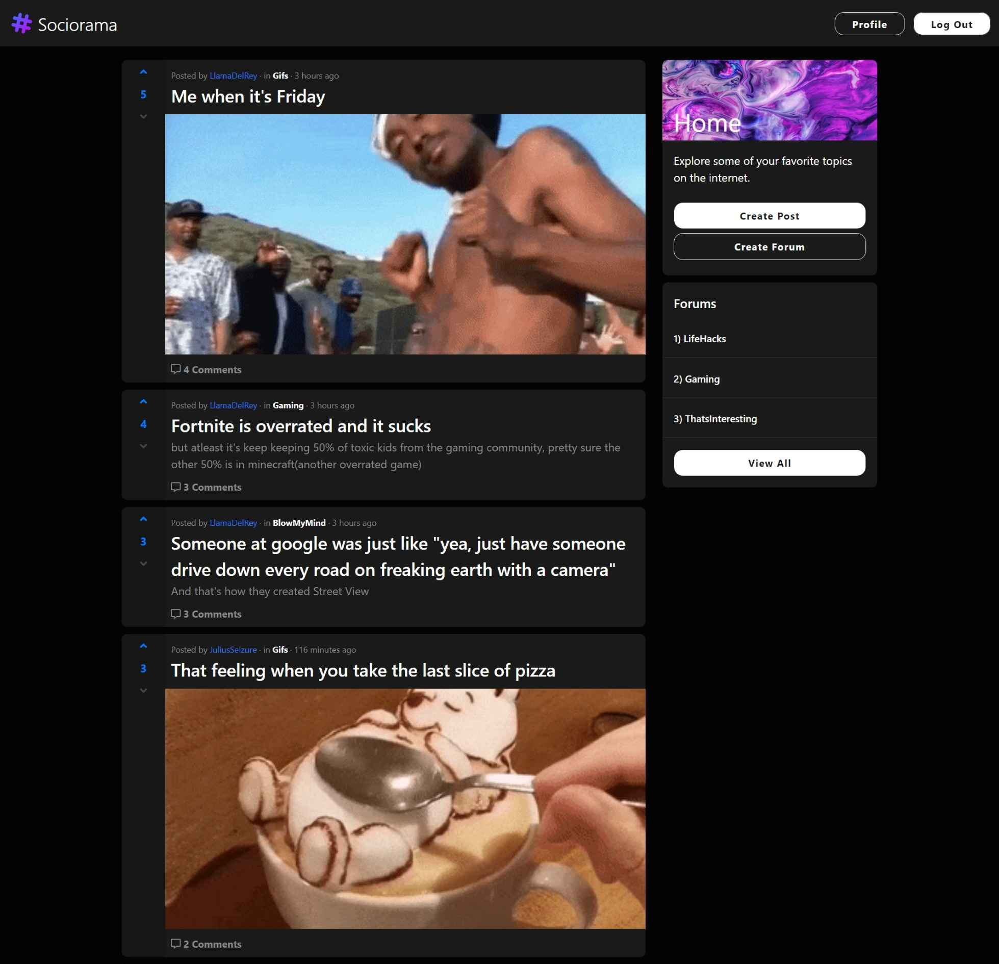
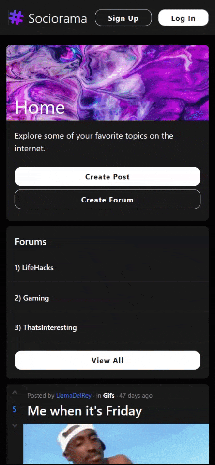
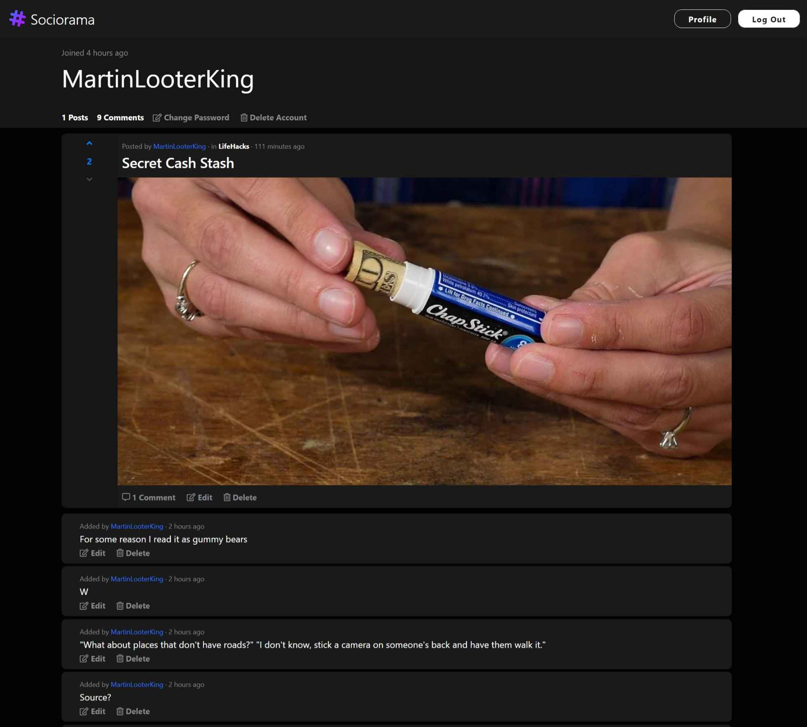
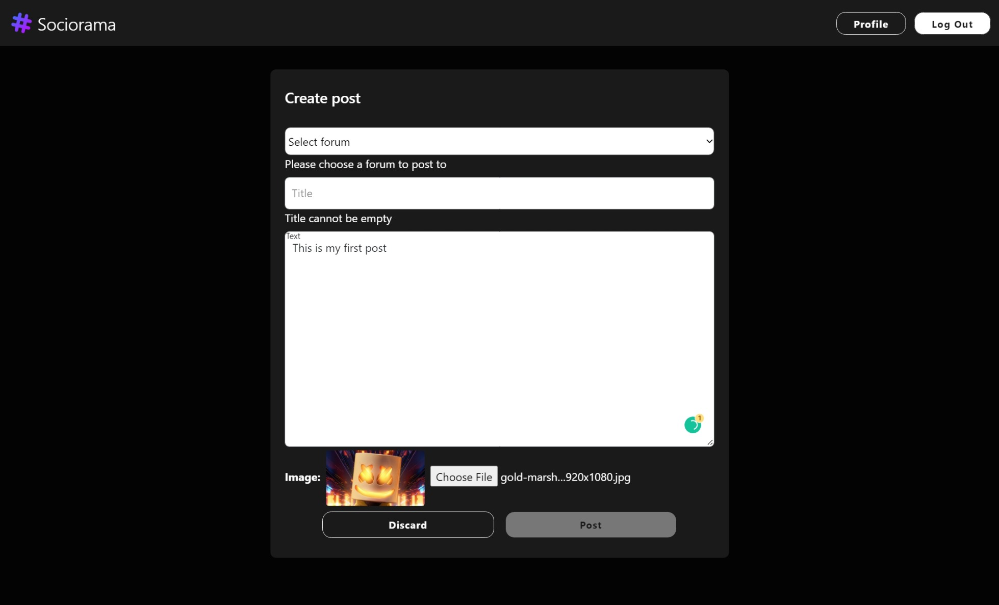
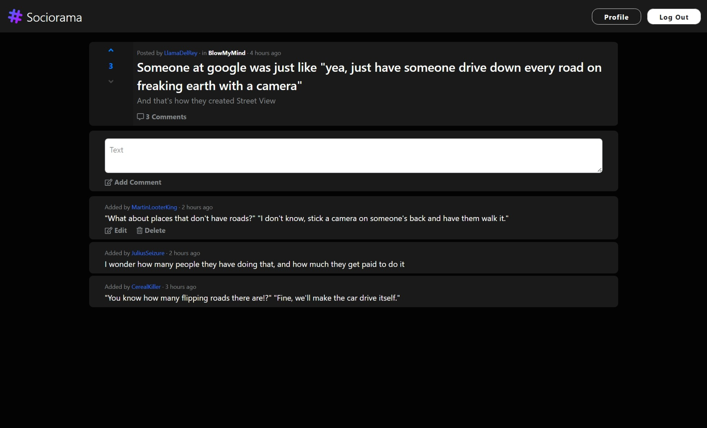
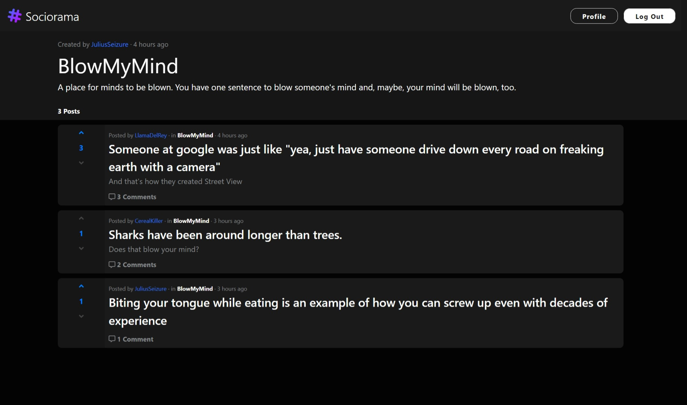

# Sociorama

Sociorama is a blog/social sharing site where you can post to a forum and other users can share their thoughts via comments or likes.

> Angular Typescript PWA responsive progressive-web-app bootstrap material

The frontend is built with Angular and is fully responsive. Data is stored and retrieved from a backend application (via REST endpoints) using Angular HttpClient. Here is a [demo of the app](), and its [backend](https://github.com/badass-techie/Sociorama-API).

## Features

- Create a user account
- Activate your account via email
- Login to your account
- Change your password or delete your account
- Create a forum, post, comment
- Like a post
- View all posts, posts in a forum, posts by user
- View all forums
- View all comments on a post, comments by user
- Edit and delete your posts, comments, and forums
- Logout

## Screenshots

### Homepage

### User Profile

### Create Post

### View Post

### Forum Page

## Improving the User Experience

- [ ] Lazy load content in feeds (posts, comments, etc.) and only load more items when the user scrolls to the bottom of the page.
- [ ] Use a caching mechanism to improve loading speeds.
